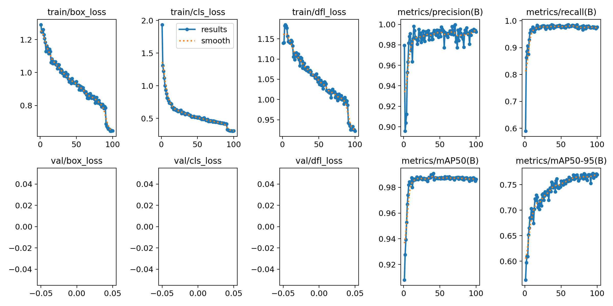
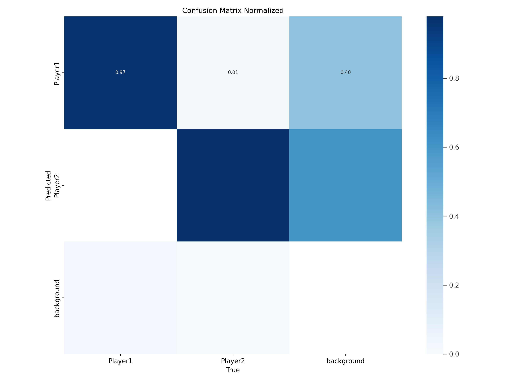
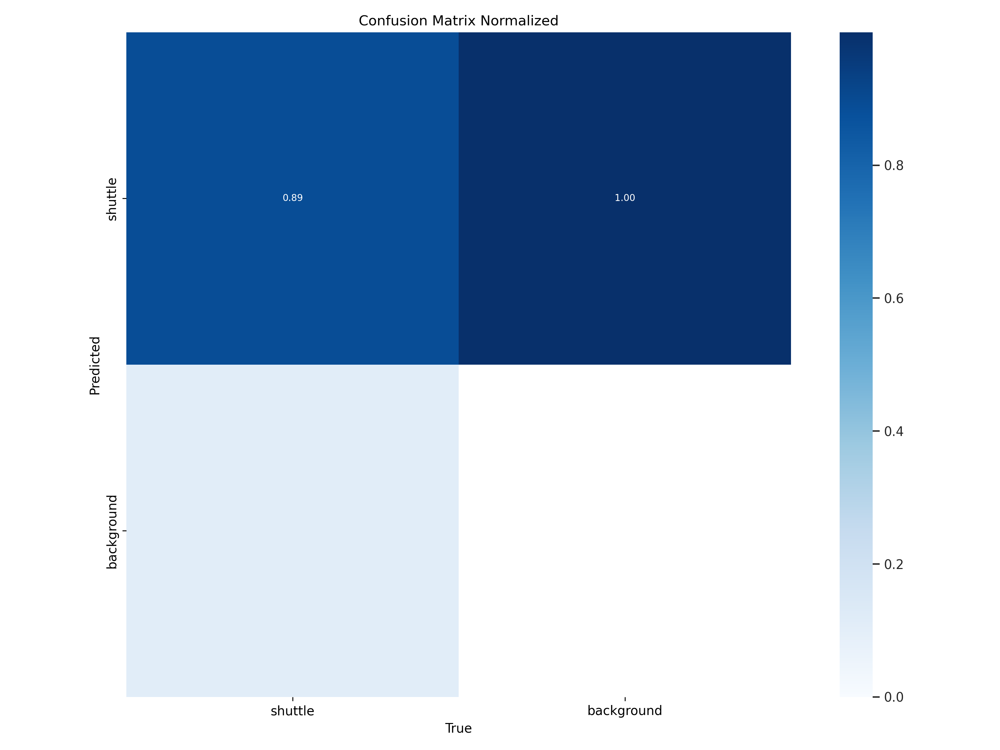

# Badminton-Analysis using Computer Vision

## Introduction
This project utilizes computer vision techniques to detect players and shuttlecocks in badminton games. By leveraging advanced computer vision algorithms, aim to provide accurate detection of players and shuttlecocks to enhance the analysis of badminton matches.

## Result

<p align="center">
  
</p>

<p align="center"><em>Result</em></p> 

## Installation
1. Clone this repository:
    ```
    git clone https://github.com/ToanNguyenKhanh/Badminton-Analysis.git
    cd Badminton-Analysis
    ```

2. Install the required dependencies:
    ```
    pip install -r requirements.txt
    ```

3. Download pre-trained models:
    - Download the necessary pre-trained models for player and shuttlecock detection and place them in the `models/` directory.

## Usage
1. Prepare your dataset:
    - Ensure your dataset contains videos or images of badminton matches with annotated player and shuttlecock positions.
    - Organize the dataset into appropriate directories, such as 'train' and 'val' for training and validation data.

2. Train the model:
    - Modify the training configuration in the train.py file according to your dataset.

3. Analyze new videos or images:
    - Use the trained model to detect players and shuttlecocks in badminton matches

4. Result






## Dataset Preparation
Ensure your dataset contains diverse videos or images of badminton matches, depicting various players, courts, and lighting conditions. Annotated bounding boxes should accurately enclose the players and shuttlecock in the frames.

## Model Configuration
Experiment with different model configurations and adjust parameters such as input image size, batch size, and training epochs to optimize performance based on your specific requirements and computational resources.

## Contributing
Contributions to this project are welcome. Feel free to submit pull requests for bug fixes, enhancements, or additional features.

## License
This project is licensed under the MIT License. See the `LICENSE` file for details.

